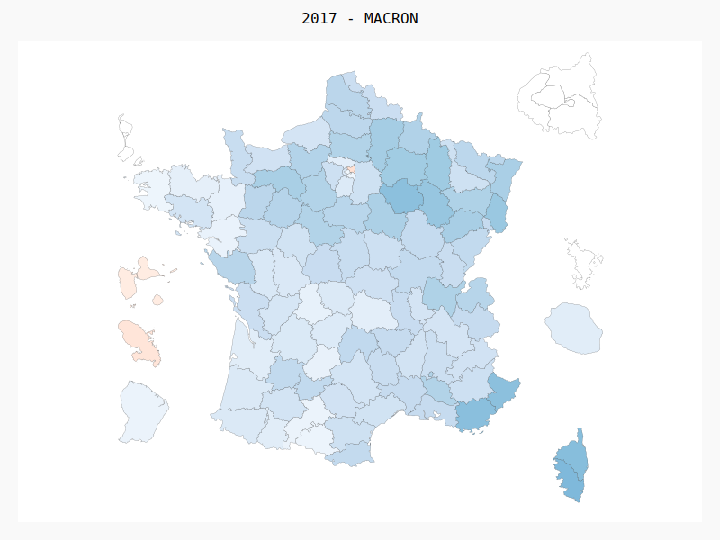

# data.fr.ElectionPresidentielle

**raw data**  
Source : [data.gouv.fr](https://www.data.gouv.fr/) @[Ministère de l'Intérieur](https://www.data.gouv.fr/fr/organizations/ministere-de-l-interieur/)  
Licence : Licence Ouverte / Open Licence  

## Analyse
Pour chaque département, on analyse le positionnement politique entre gauche et droite lors du premier tour.
Un vote est compté pour un côté s'il est donné à un candidat situé du bord politique en question (y compris les parties d’extrêmes gauche / droite).

## Avertissement biais

Le positionnement d’un parti peut être subjectif, voici une liste (non exhaustive) de choix qui pourrait être discuté ou ne pas correspondre.
* EELV : gauche
* MoDEM : centre
* EM : 2017 centre, 2022 droite

Les résultats pour 2022 sont récents et sont issus de données publiées par la communauté.

# Visualisation

<object data="2022_t1.svg" type="image/svg+xml">  </object>
<object data="2017_t1.svg" type="image/svg+xml">  </object>
<object data="2012_t1.svg" type="image/svg+xml">  </object>
<object data="2007_t1.svg" type="image/svg+xml">  </object>
<object data="2002_t1.svg" type="image/svg+xml">  </object>
<object data="1995_t1.svg" type="image/svg+xml">  </object>
